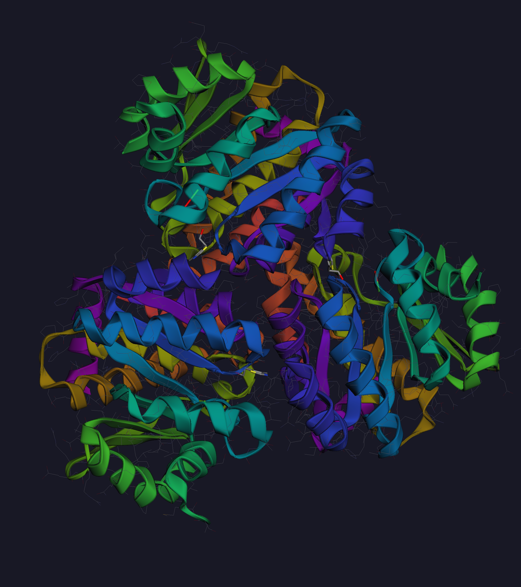

# LADOCK Desktop

**Open-source molecular docking workstation** built on the LADOCK pipeline, with a modern PySide6 GUI and dark Catppuccin theme.



---

## Features

- **Multi-engine docking** — AutoDock Vina, AutoDock 4, VinaGPU, AutoDock-GPU
- **Batch docking** — run multiple ligands in parallel with built-in job scheduler
- **Ligand library management** — import from CSV, SDF, or PDBQT; SMILES rendering via RDKit
- **Interactive 3D viewer** — 3Dmol.js-powered molecular visualization
- **Non-covalent interaction analysis** — H-bond, π-stacking, hydrophobic contacts, and more
- **Result explorer** — sortable tables with binding energy results
- **Project management** — save/load docking projects with structured job directories
- **WSL support** — run Linux docking binaries from Windows via WSL backend

---

## Requirements

- Python ≥ 3.10
- PySide6 ≥ 6.5
- NumPy ≥ 1.24
- SciPy ≥ 1.10
- pandas ≥ 2.0
- RDKit (optional, for SMILES rendering and ligand preparation)

---

## Installation

### Windows

```bat
# Clone the repository
git clone https://github.com/your-org/ladock-desktop.git
cd ladock-desktop

# Install dependencies (Miniconda/Anaconda recommended)
python -m pip install -e .

# Optional: install RDKit support
python -m pip install -e ".[rdkit]"
```

### Linux / WSL

```bash
git clone https://github.com/your-org/ladock-desktop.git
cd ladock-desktop
pip install -e .
```

---

## Usage

### Windows

Double-click `ladock.bat`, or from a terminal:

```bat
ladock.bat
```

### Linux / macOS

```bash
bash ladock.sh
```

### WSL (Windows Subsystem for Linux)

```bat
ladock-wsl.bat
```

### Python (cross-platform)

```bash
python main.py
```

---

## Project Structure

```
LADOCK/
├── app/                  # Application layer (main window, dialogs, project manager)
├── core/                 # Core utilities (job scheduler, WSL backend, tool paths)
├── data/                 # Data models (project, ligand library, result parser)
├── engine/               # Docking engine, tool detector, molecule prep
├── gui/                  # Theme and UI panels
│   └── panels/           # Docking prep, job manager, result explorer, etc.
├── bin/                  # Bundled binaries (ADFRsuite, AutoDock Vina, etc.)
├── main.py               # Entry point
├── ladock.bat            # Windows launcher
├── ladock.sh             # Linux/macOS launcher
└── ladock-wsl.bat        # WSL launcher
```

---

## Bundled Tools

The following tools are bundled in `bin/` and require no separate installation:

| Tool | Version |
|------|---------|
| AutoDock Vina | 1.2.7 |
| AutoDock 4 | — |
| ADFR / AGFR | ADFRsuite 1.0 |
| MGLTools | — |
| OpenBabel | — |

External tools (AutoDock-GPU, VinaGPU) can be configured via **Settings → Tool Paths**.

---

## Citation

If you use LADOCK in your research, please cite:

> Aman LO, Ischak NI, Tuloli TS, Arfan A, Asnawi A. (2024). Multiple ligands simultaneous molecular docking and dynamics approach to study the synergetic inhibitory of curcumin analogs on ErbB4 tyrosine phosphorylation. *Research in Pharmaceutical Sciences*, 19(6), 754–765. https://doi.org/10.4103/RPS.RPS_191_23

> Aman LO, Sihaloho M, Arfan A. (2023). Pencarian inhibitor DYRK2 dari database bahan alam ZINC15: Analisis farmakofor, simulasi docking dan dinamika molekuler. *Jurnal Sains Farmasi & Klinis*, 10(1), 100–113. https://doi.org/10.25077/jsfk.10.1.100-113.2023

> Aman LO, Arfan A, Asnawi A. (2023). In silico study of the synergistic interaction of 5-fluorouracil and curcumin analogues as inhibitors of B-cell lymphoma 2 protein. *International Journal of Applied Pharmaceutics*, 15(Special Issue 2), 61–66. https://doi.org/10.22159/ijap.2023.v15s2.05

### Third-party tools

- **AutoDock Vina**: Eberhardt J. et al. (2021) *J. Chem. Inf. Model.* 61(8):3891–3898. https://doi.org/10.1021/acs.jcim.1c00203
- **RDKit**: Landrum G. https://www.rdkit.org
- **3Dmol.js**: Rego N. & Koes D. (2015) *Bioinformatics* 31(8):1322–1324. https://doi.org/10.1093/bioinformatics/btu829

---

## License

MIT License — see [LICENSE](LICENSE) for details.
