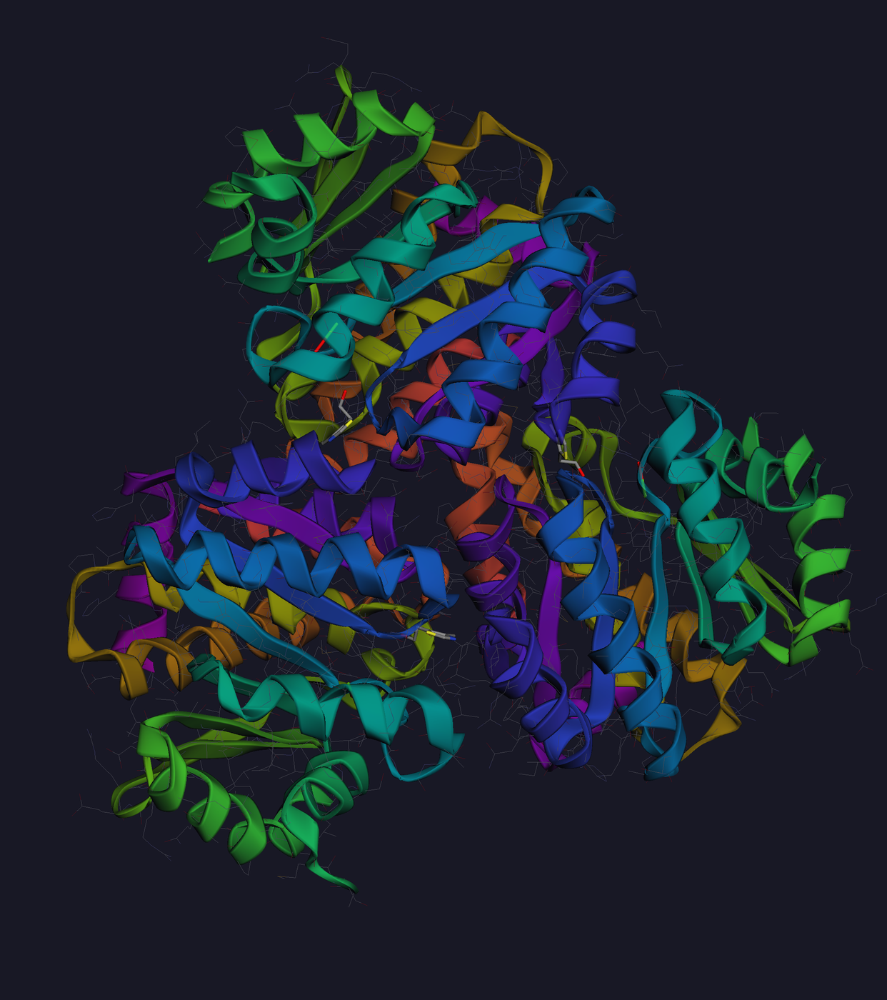

# LADOCK

**Molecular docking workstation** built on the LADOCK pipeline, shipped as one package with two front-ends:

| Command | What it is |
|---------|------------|
| `ladock-desktop` | PySide6 GUI workstation, dark Catppuccin theme |
| `ladock-cli` | Rule-based (non-LLM) docking agent — guided wizard or fully scripted |

Both share the same engines, the same preparation pipeline, and the same bundled `bin/` tree. Proprietary software — free for academic use, commercial license required for for-profit use (see [License](#license)).



---

## Features

- **Multi-engine docking** — AutoDock Vina, AutoDock 4, VinaGPU, AutoDock-GPU
- **Batch docking** — run multiple ligands in parallel with built-in job scheduler
- **Ligand library management** — import from CSV, SDF, or PDBQT; SMILES rendering via RDKit
- **Interactive 3D viewer** — 3Dmol.js-powered molecular visualization
- **Non-covalent interaction analysis** — H-bond, π-stacking, hydrophobic contacts, and more
- **Result explorer** — sortable tables with binding energy results
- **Project management** — save/load docking projects with structured job directories
- **Native cross-platform prep** — receptor/ligand PDBQT preparation runs natively on Windows, Linux and macOS via Meeko + RDKit (no MGLTools, no WSL required for Vina/Vinardo)
- **Platform-aware engines** — the docking UI enables only the scoring functions supported where LADOCK runs. The Windows build is pure-native (Vina/Vinardo); AutoDock4 / AutoDock-GPU are Linux-only and become available by running LADOCK inside WSL or on Linux

---

## Requirements

- Python ≥ 3.10
- PySide6 ≥ 6.5
- NumPy ≥ 1.24
- SciPy ≥ 1.10
- pandas ≥ 2.0
- RDKit ≥ 2023.3 — molecular preparation and SMILES rendering
- Meeko ≥ 0.5 (+ gemmi) — native receptor/ligand PDBQT preparation

---

## Installation

One install provides both commands (Miniconda/Anaconda recommended on Windows):

```bash
pip install ladock
```

> **Upgrading from LADOCK 0.1.x?** Releases up to `0.1.6` (March 2024) were a
> different, Apache-2.0 licensed command-line tool published under the same PyPI
> name. Version 2.0 is a rewrite with new commands (`ladock-cli`,
> `ladock-desktop`) and a different licence — see [License](#license). Pin
> `ladock==0.1.6` if you depend on the old behaviour.

From a source checkout:

```bash
git clone https://github.com/laode-aman-ung/LADOCK.git
cd LADOCK
pip install -e .
```

The docking engines are far too large for a wheel, so they are fetched once,
after install:

```bash
ladock-fetch-binaries
```

That downloads `bin/<platform>/` into the package. If the install directory is
read-only, put the binaries anywhere and point `LADOCK_BIN` at them.

---

## Usage

```bash
ladock-desktop        # GUI workstation
ladock-cli            # guided docking wizard
ladock-cli dock --receptor rec.pdb --ligand lib.sdf --out results/ --native-ligand LIG
```

Equivalent module invocations — `python -m ladock.desktop`, `python -m ladock.cli` —
work from a source checkout without installing.

### WSL (Windows Subsystem for Linux)

AutoDock4 / AutoDock-GPU are Linux-only. Run LADOCK inside WSL, or from Windows:

```bat
scripts\ladock-wsl.bat
```

The launcher scripts in `scripts/` (`ladock.sh`, `ladock.bat`, `ladock.ps1`,
`install.*`) remain for source checkouts and desktop shortcuts; they discover a
suitable Python and start the same entry points.

---

## Workspace Structure

```
LADOCK/
├── ladock/               # The installed package (distribution: "ladock")
│   ├── paths.py          # Where bin/ and bundled resources live (shared)
│   ├── binaries.py       # `ladock-fetch-binaries`
│   ├── cli/              # `ladock-cli` — rule-based docking agent
│   │   └── agent.py      #   wizard, dock/components/prepare-receptor commands
│   ├── desktop/          # `ladock-desktop` — GUI workstation
│   │   ├── main.py       #   entry point
│   │   ├── app/          #   main window, dialogs, project manager
│   │   ├── core/         #   job models, WSL backend, tool paths, licensing
│   │   ├── data/         #   project model, result parser
│   │   ├── engine/       #   molecule prep, interaction analyzer, tool detector
│   │   ├── gui/          #   theme, panels, 3D viewer, assets
│   │   └── config/       #   example inputs
│   └── bin/              # Engine binaries, per platform (fetched, not in git):
│       ├── windows/      #   Vina (native .exe)
│       ├── linux/        #   Vina, AutoDock4/AutoGrid4, AD-GPU, ADFRsuite, MGLTools
│       └── mac/          #   Vina (native)
├── scripts/              # Launchers & installers for source checkouts
├── packaging/            # Release staging, PyInstaller spec, OS installers
├── docs/                 # CLI agent documentation
├── website/              # Project website (static HTML/CSS/JS)
└── HAKI/                 # Intellectual property (HakCipta, Merek)
```

---

## Bundled Tools

Binaries live per platform under `ladock/bin/<platform>/`, fetched once with `ladock-fetch-binaries`:

| Tool | Version | windows | linux | mac |
|------|---------|:-------:|:-----:|:---:|
| AutoDock Vina | 1.2.7 | ✅ | ✅ | ✅ |
| AutoDock 4 / AutoGrid 4 | — | | ✅ | |
| AutoDock-GPU | 1.6 | | ✅ | |
| ADFR / AGFR | ADFRsuite 1.0 | | ✅ | |
| MGLTools | 1.5.6 | | ✅ | |
| OpenBabel | 2.4.1 (in ADFRsuite) | | ✅ | |

Receptor and ligand PDBQT preparation is done **natively** by Meeko + RDKit on all
platforms, so the Linux-only MGLTools bundle is only needed for the AutoDock4 /
AutoDock-GPU grid path and flexible-receptor mode. The **Windows build is
pure-native** (Vina/Vinardo only) and is deliberately *not* combined with WSL — to
use the Linux engines, run LADOCK **inside** WSL or on Linux, where the app detects
itself as a Linux host and enables the full engine set.

External tools (AutoDock-GPU, VinaGPU) can also be configured via **Settings → Tool Paths**.

---

## Citation

If you use LADOCK in your research, please cite:

> Aman LO, Ischak NI, Tuloli TS, Arfan A, Asnawi A. (2024). Multiple ligands simultaneous molecular docking and dynamics approach to study the synergetic inhibitory of curcumin analogs on ErbB4 tyrosine phosphorylation. *Research in Pharmaceutical Sciences*, 19(6), 754–765. https://doi.org/10.4103/RPS.RPS_191_23

> Aman LO, Sihaloho M, Arfan A. (2023). Pencarian inhibitor DYRK2 dari database bahan alam ZINC15: Analisis farmakofor, simulasi docking dan dinamika molekuler. *Jurnal Sains Farmasi & Klinis*, 10(1), 100–113. https://doi.org/10.25077/jsfk.10.1.100-113.2023

> Aman LO, Arfan A, Asnawi A. (2023). In silico study of the synergistic interaction of 5-fluorouracil and curcumin analogues as inhibitors of B-cell lymphoma 2 protein. *International Journal of Applied Pharmaceutics*, 15(Special Issue 2), 61–66. https://doi.org/10.22159/ijap.2023.v15s2.05

### Third-party tools

- **AutoDock Vina**: Eberhardt J. et al. (2021) *J. Chem. Inf. Model.* 61(8):3891–3898. https://doi.org/10.1021/acs.jcim.1c00203
- **RDKit**: Landrum G. https://www.rdkit.org
- **3Dmol.js**: Rego N. & Koes D. (2015) *Bioinformatics* 31(8):1322–1324. https://doi.org/10.1093/bioinformatics/btu829

---

## License

LADOCK Desktop is **proprietary software** — Copyright (c) 2024 La Ode Aman. All rights reserved. See [LICENSE](LICENSE) for the full terms.

- **Free non-commercial use (2024–2029):** free of charge for **everyone** — students, academics, independent researchers, and the general public — for non-commercial research, study, teaching, and evaluation. **No registration, institutional email, or license key is required**; the app activates the free academic license automatically until December 31, 2029. Subject to the citation requirement above.
- **Commercial use:** requires a paid **commercial license** (for-profit companies, CROs, pharmaceutical/biotech firms, or any commercial R&D). Contact the licensor at laode_aman@ung.ac.id.

This is **not** an open-source license. Redistribution, sublicensing, and resale are not permitted.
